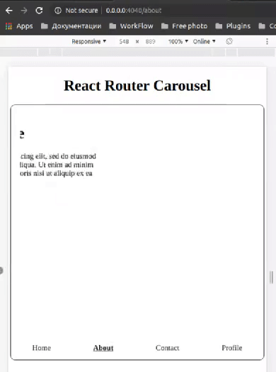

# React Router Carousel(beta@0.1.2)

React carousel with the ability to switch routes, both with the usual swipe, and with the ability to add zones for swipe on the site

[](https://maddevs.io)
&nbsp;

## Issues
* `<Route path="*" component={FallbackPage} />` - ignores routes in the carousel. Please add the fallbackRoute prop for RouterCarousel with the 404 page component, as in the example below
* It is mandatory to pass `history` & `location` to props.

## Installation

```bash
npm install --save react-router-carousel
```

## Props for wrap carousel

|    Property   | Type | Description | Default | Example | 
| ------------- | ---- | ----------- | ------- | ------- |
| history | object | BrowserRouter history | undefined | |
| location | object | BrowserRouter location | undefined | |
| sliderMode  | bool | Standart carousel mode. `Router will not switch` | false |  |
| swipeLeftClassName  | string | Custom className for swipe left zone | null |  |
| swipeRightClassName  | string | Custom className for swipe right zone | null |  |
| fallbackRoute | component | If the entered route is not found this is the component that will be displayed | null | `<FallbackPage />` |

## Props for slide

|    Property   | Type | Description | Default |
| ------------- | ---- | ----------- | ------- |
| index  | number | Set active slider. Work only props `sliderMode` | 1 |
| swipeleft  | bool | Enable swipe left zone. If uses with props `sliderMode` add `true` or `false` - `swipeleft="true"` | false |
| swiperight  | bool | Enable swipe right zone. If uses with props `sliderMode` add `true` or `false` - `swiperight="true"` | false |


## Example

**Demo** - [https://denisoed.github.io/react-router-carousel](https://denisoed.github.io/react-router-carousel)

`Look at the page url`<br>


```js
import React, { Component } from 'react';
import RouterCarousel from 'react-router-carousel';
import {
  Route,
  NavLink,
  Switch
} from 'react-router-dom';
import AuthHoc from './AuthHoc';

// Components
const Home = () => (
  <div style={{ width: '100%', height: 540 }}>
    <h1>Home page</h1>
    <p>
      Lorem ipsum dolor sit amet, consectetur adipiscing elit, sed do eiusmod
      tempor incididunt ut labore et dolore magna aliqua. Ut enim ad minim
      veniam, quis nostrud exercitation ullamco laboris nisi ut aliquip ex ea
      commodo consequat.
    </p>
  </div>
);

const About = () => (
  <div style={{ width: '100%', height: 540 }}>
    <h1>About page</h1>
    <p>
      Lorem ipsum dolor sit amet, consectetur adipiscing elit, sed do eiusmod
      tempor incididunt ut labore et dolore magna aliqua. Ut enim ad minim
      veniam, quis nostrud exercitation ullamco laboris nisi ut aliquip ex ea
      commodo consequat.
    </p>
    <NavLink to='/map' activeClassName='activeRoute'>
      Map
    </NavLink>
  </div>
);

const Contact = ({ history, location }) => (
  <div style={{ width: '100%', height: 540, position: 'relative' }}>
    <h1>Contact page</h1>
    <p>
      Lorem ipsum dolor sit amet, consectetur adipiscing elit, sed do eiusmod
      tempor incididunt ut labore et dolore magna aliqua. Ut enim ad minim
      veniam, quis nostrud exercitation ullamco laboris nisi ut aliquip ex ea
      commodo consequat.
    </p>
    <section
      style={{
        width: '70%',
        height: 70,
        position: 'relative',
        margin: '0 auto'
      }}
    >
      <RouterCarousel
        sliderMode
        index="1"
        swipeLeftClassName={'router-carousel-zone router-carousel-zone--left'}
        swipeRightClassName={'router-carousel-zone router-carousel-zone--right'}
        history={history}
        location={location}
      >
        <h2 swipeleft='false' swiperight='true'>
          EMail
        </h2>
        <h2>Phone number</h2>
        <h2>Address</h2>
      </RouterCarousel>
    </section>
  </div>
);

const Profile = () => (
  <div style={{ width: '100%', height: 540 }}>
    <h1>Profile page</h1>
    <p>
      Lorem ipsum dolor sit amet, consectetur adipiscing elit, sed do eiusmod
      tempor incididunt ut labore et dolore magna aliqua. Ut enim ad minim
      veniam, quis nostrud exercitation ullamco laboris nisi ut aliquip ex ea
      commodo consequat.
    </p>
  </div>
);

const Map = () => (
  <div style={{ width: '100%', height: 540 }}>
    <h1>Map page</h1>
    <p>
      Lorem ipsum dolor sit amet, consectetur adipiscing elit, sed do eiusmod
      tempor incididunt ut labore et dolore magna aliqua. Ut enim ad minim
      veniam, quis nostrud exercitation ullamco laboris nisi ut aliquip ex ea
      commodo consequat.
    </p>
  </div>
);

const Login = () => (
  <div style={{ width: '100%', height: 540 }}>
    <h1>Login page</h1>
    <h3>React Hoc is works!</h3>
    <p>
      If the user is not authorized, it will be transferred to the authorization
      page
    </p>
  </div>
);

const FallbackPage = () => (
  <div style={{ width: '100%', height: 540 }}>
    <h1>404 page</h1>
    <p>
      Lorem ipsum dolor sit amet, consectetur adipiscing elit, sed do eiusmod
      tempor incididunt ut labore et dolore magna aliqua. Ut enim ad minim
      veniam, quis nostrud exercitation ullamco laboris nisi ut aliquip ex ea
      commodo consequat.
    </p>
  </div>
);

const Carousel = ({ history, location }) => (
  <RouterCarousel
    swipeLeftClassName={'router-carousel-zone router-carousel-zone--left'}
    swipeRightClassName={'router-carousel-zone router-carousel-zone--right'}
    fallbackRoute={<FallbackPage />}
    history={history}
    location={location}
  >
    <Route exact path='/' component={Home} />
    <Route path='/about' component={About} />
    <Route path='/contact' component={Contact} swipeleft swiperight />
    <Route path='/profile' component={AuthHoc(Profile)} />
  </RouterCarousel>
);

const App = () => {
  return (
    <>
      <h1>React Router Carousel</h1>
      <div
        style={{
          textAlign: 'center',
          width: '98%',
          height: 540,
          borderRadius: 10,
          border: '1px solid #222',
          padding: 20,
          boxSizing: 'border-box',
          margin: '0 auto',
          position: 'relative',
          overflow: 'hidden'
        }}
      >
        <Switch>
          <Route path='/map' component={Map} />
          <Route path='/login' component={Login} />
          <Route path='*' component={Carousel} />
        </Switch>
        <div className='menu'>
          <NavLink exact to='/' activeClassName='activeRoute'>
            Home
          </NavLink>
          <NavLink to='/about' activeClassName='activeRoute'>
            About
          </NavLink>
          <NavLink to='/contact' activeClassName='activeRoute'>
            Contact
          </NavLink>
          <NavLink to='/profile' activeClassName='activeRoute'>
            Profile
          </NavLink>
        </div>
      </div>
    </>
  );
};
```

> Example can be found in the [example/](./example/src/App.js) folder

## Development

> Boilerplate for create react plugins - https://github.com/transitive-bullshit/create-react-library

Local development is broken into two parts (ideally using two tabs).

First, run rollup to watch your `src/` module and automatically recompile it into `dist/` whenever you make changes.

```bash
npm start # runs rollup with watch flag
```

The second part will be running the `example/` create-react-app that's linked to the local version of your module.

```bash
# (in another tab)
cd example
npm start # runs create-react-app dev server
```

Now, anytime you make a change to your library in `src/` or to the example app's `example/src`, `create-react-app` will live-reload your local dev server so you can iterate on your component in real-time.

#### Publishing to npm

```bash
npm publish
```

This builds `commonjs` and `es` versions of your module to `dist/` and then publishes your module to `npm`.

Make sure that any npm modules you want as peer dependencies are properly marked as `peerDependencies` in `package.json`. The rollup config will automatically recognize them as peers and not try to bundle them in your module.

#### Deploying to Github Pages

```bash
npm run deploy
```

This creates a production build of the example `create-react-app` that showcases your library and then runs `gh-pages` to deploy the resulting bundle.

## Use with React Hooks

If you use [react-hooks](https://reactjs.org/docs/hooks-intro.html) in your project, when you debug your example you may run into an exception [Invalid Hook Call Warning](https://reactjs.org/warnings/invalid-hook-call-warning.html). This [issue](https://github.com/facebook/react/issues/14257) explains the reason, your lib and example use a different instance, one solution is rewrite the `react` path in your example's `package.json` to 'file:../node_modules/react' or 'link:../node_modules/react'.
